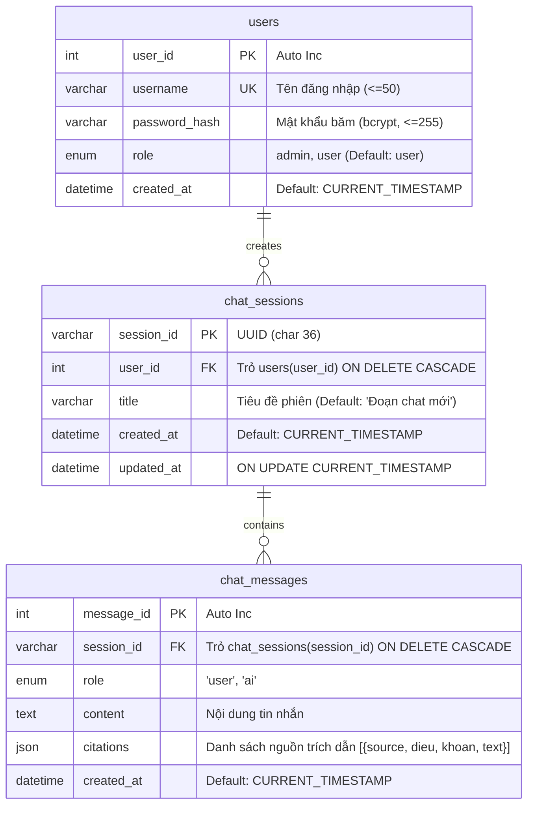

# TÀI LIỆU ĐẶC TẢ THIẾT KẾ HỆ THỐNG (SPECIFICATION)
## DỰ ÁN: HỆ THỐNG TRUY CỨU HỎI ĐÁP TỰ ĐỘNG VỀ LUẬT GIAO THÔNG ĐƯỜNG BỘ VIỆT NAM (RAG)
**Mã nhánh Git:** `feat/auth-history-ui-redesign`  
**Phiên bản:** 1.0.0  
**Ngày lập:** 30/09/2026  
**Dựa trên:** Báo cáo Đồ án 74DCTT22 & Quy chuẩn thiết kế `DESIGN.md` (Perplexity AI Style)

---

## 1. TỔNG QUAN VÀ BẢN ĐỒ NĂNG LỰC (CAPABILITY MAP)

### 1.1. Mục tiêu (Objective)
Hiện đại hóa toàn diện hệ thống Hỏi đáp Luật Giao thông Việt Nam (RAG):
1. **Thay thế Streamlit bằng React (Vite) + Tailwind CSS** theo phong cách giao diện nghiên cứu tối giản, ấm áp (Perplexity AI warm research terminal, canvas `#faf8f5`, tối đa hóa khả năng tập trung của người dùng).
2. **Xây dựng module Xác thực người dùng (Auth)**: Đăng ký, Đăng nhập, Đăng xuất với bảo mật JWT và lưu trữ MySQL.
3. **Xây dựng module Lịch sử tra cứu (History)**: Quản lý phiên chat (`chat_sessions`), lưu trữ chi tiết từng tin nhắn (`chat_messages`) kèm siêu dữ liệu nguồn luật trích dẫn (`citations`).
4. **Nâng cấp RAG Streaming & Citations**: API stream trả về token theo thời gian thực (SSE) kèm trích dẫn văn bản luật (Tên luật/Nghị định, Điều, Khoản, Trích đoạn).

### 1.2. Bản đồ Năng lực (Capability Map)

| Module ID | Tên Module | Trách nhiệm chính | Phụ thuộc |
|---|---|---|---|
| `db-mysql` | Cơ sở dữ liệu quan hệ | Tạo bảng `users`, `chat_sessions`, `chat_messages`, kết nối qua SQLAlchemy | — |
| `auth-service` | Dịch vụ xác thực | Băm mật khẩu (bcrypt), cấp phát & xác thực JWT Bearer Token | `db-mysql` |
| `auth-api` | API Đăng ký / Đăng nhập / Đăng xuất | Các endpoint `/api/auth/register`, `/api/auth/login`, `/api/auth/me` | `auth-service` |
| `history-api` | API Quản lý Lịch sử Chat | Các endpoint `/api/sessions`, `/api/sessions/{id}`, xóa phiên | `auth-service`, `db-mysql` |
| `rag-stream-api` | API RAG Chat & Trích dẫn | Endpoint `/api/chat/stream` (SSE), đồng bộ lịch sử vào DB | `history-api`, Qdrant |
| `frontend-spa` | Giao diện React SPA | Sidebar 220px (History, Auth), Main 640px (Hero Search, Streaming, Citations) | Tất cả API |

**Thứ tự xây dựng (Build Order):**  
`db-mysql` → `auth-service` & `auth-api` → `history-api` → `rag-stream-api` → `frontend-spa`.

---

## 2. THIẾT KẾ CƠ SỞ DỮ LIỆU (DATABASE SCHEMA - MySQL)

Dựa trên thiết kế tại Mục 3.2.7.1 của Báo cáo đồ án:



### Chi tiết các trường:
1. **Bảng `users`**:
   - `user_id`: INT AUTO_INCREMENT PRIMARY KEY
   - `username`: VARCHAR(50) NOT NULL UNIQUE
   - `password_hash`: VARCHAR(255) NOT NULL
   - `role`: ENUM('admin', 'user') NOT NULL DEFAULT 'user'
   - `created_at`: DATETIME NOT NULL DEFAULT CURRENT_TIMESTAMP

2. **Bảng `chat_sessions`**:
   - `session_id`: VARCHAR(36) PRIMARY KEY (UUID v4)
   - `user_id`: INT NOT NULL, FOREIGN KEY (`user_id`) REFERENCES `users`(`user_id`) ON DELETE CASCADE
   - `title`: VARCHAR(255) DEFAULT 'Đoạn chat mới'
   - `created_at`: DATETIME NOT NULL DEFAULT CURRENT_TIMESTAMP
   - `updated_at`: DATETIME NULL ON UPDATE CURRENT_TIMESTAMP

3. **Bảng `chat_messages`**:
   - `message_id`: INT AUTO_INCREMENT PRIMARY KEY
   - `session_id`: VARCHAR(36) NOT NULL, FOREIGN KEY (`session_id`) REFERENCES `chat_sessions`(`session_id`) ON DELETE CASCADE
   - `role`: ENUM('user', 'ai') NOT NULL
   - `content`: LONGTEXT NOT NULL
   - `citations`: JSON NULL (lưu `[{"source": "...", "dieu": "...", "khoan": "...", "diem": "...", "page_content": "..."}]`)
   - `created_at`: DATETIME NOT NULL DEFAULT CURRENT_TIMESTAMP

---

## 3. THIẾT KẾ USECASE VÀ LUỒNG NGHIỆP VỤ (USE CASES)

### 3.1. UC01: Đăng ký (Register)
- **Actor:** Guest (Khách)
- **Tiền điều kiện:** Người dùng chưa đăng nhập, mở modal Đăng ký.
- **Dữ liệu đầu vào:** `username` (tối thiểu 3 ký tự, không chứa ký tự đặc biệt), `password` (tối thiểu 6 ký tự), `confirm_password`.
- **Luồng sự kiện chính:**
  1. Người dùng nhập thông tin và nhấn "Đăng ký".
  2. Frontend kiểm tra tính hợp lệ (mật khẩu khớp, độ dài).
  3. Frontend gửi `POST /api/auth/register`.
  4. Backend kiểm tra `username` trong DB. Nếu chưa tồn tại, băm mật khẩu bằng `bcrypt` và lưu vào bảng `users`.
  5. Backend tạo JWT Access Token và trả về thông tin người dùng.
  6. Frontend lưu token, cập nhật trạng thái đăng nhập, đóng modal và tải danh sách lịch sử.
- **Ngoại lệ:**
  - `username` đã tồn tại: Báo lỗi "Tên đăng nhập đã được sử dụng".
  - Dữ liệu trống / sai định dạng: Báo lỗi tại trường tương ứng.

### 3.2. UC02: Đăng nhập (Login)
- **Actor:** Guest
- **Tiền điều kiện:** Người dùng đã có tài khoản.
- **Dữ liệu đầu vào:** `username`, `password`.
- **Luồng sự kiện chính:**
  1. Người dùng nhập `username`, `password` và nhấn "Đăng nhập".
  2. Frontend gửi `POST /api/auth/login`.
  3. Backend kiểm tra tài khoản và so khớp mật khẩu `bcrypt.checkpw()`.
  4. Nếu khớp, Backend sinh JWT (hạn 7 ngày) kèm thông tin `user_id`, `username`, `role`.
  5. Frontend lưu JWT vào `localStorage` (hoặc State), kích hoạt đồng bộ lịch sử.
- **Ngoại lệ:**
  - Sai tài khoản hoặc mật khẩu: Báo lỗi "Tài khoản hoặc mật khẩu không chính xác".

### 3.3. UC03: Đăng xuất (Logout)
- **Actor:** User, Admin
- **Tiền điều kiện:** Người dùng đang ở trạng thái đã đăng nhập.
- **Luồng sự kiện chính:**
  1. Người dùng nhấn nút "Đăng xuất" ở góc trái dưới thanh Sidebar.
  2. Frontend xóa JWT khỏi `localStorage`, xóa state user và state lịch sử.
  3. Hệ thống chuyển về trạng thái Guest, làm mới giao diện về màn hình chat trống.

### 3.4. UC04: Xem và Quản lý Lịch sử Tra cứu (History)
- **Actor:** User, Admin
- **Tiền điều kiện:** Người dùng đã đăng nhập.
- **Luồng sự kiện chính:**
  1. Khi người dùng đăng nhập hoặc mở ứng dụng, Frontend gọi `GET /api/sessions`.
  2. Backend truy vấn các phiên chat thuộc `user_id` hiện tại, sắp xếp theo `updated_at DESC`.
  3. Sidebar hiển thị danh sách các phiên chat (nhóm theo: Hôm nay, 7 ngày qua, Cũ hơn).
  4. Người dùng nhấn vào một phiên chat:
     - Frontend gọi `GET /api/sessions/{session_id}`.
     - Backend trả về danh sách toàn bộ tin nhắn (`user` và `ai`) kèm trích dẫn pháp lý (`citations`).
     - Giao diện nạp lịch sử và hiển thị lại toàn bộ đoạn hội thoại.
  5. Người dùng có thể:
     - Nhấn nút "Thùng rác" để xóa phiên chat (`DELETE /api/sessions/{session_id}`).
     - Đổi tên phiên chat (`PATCH /api/sessions/{session_id}`).

### 3.5. UC05: Tra cứu luật & RAG Streaming
- **Actor:** Guest, User, Admin
- **Tiền điều kiện:** Hệ thống RAG (FastAPI, Qdrant, LLM) đang hoạt động.
- **Luồng sự kiện chính:**
  1. Người dùng nhập câu hỏi vào ô tìm kiếm ở giữa màn hình (hoặc bấm câu hỏi gợi ý).
  2. Nếu là User đã đăng nhập:
     - Nếu chưa có phiên chat hiện tại: Tạo một `session_id` mới.
     - Lưu câu hỏi của User vào bảng `chat_messages`.
  3. Frontend kết nối tới `POST /api/chat/stream` qua Server-Sent Events (SSE).
  4. Backend:
     - Thực hiện sinh truy vấn phụ (Multi-query generation).
     - Truy xuất Hybrid Search (BM25 + Qdrant MMR) và làm giàu ngữ cảnh (Sibling chunk enrichment theo Điều).
     - Rút trích danh sách `citations` (Tên nguồn, Điều, Khoản, Trích đoạn).
     - Đẩy prompt vào LLM và stream từng token về client.
     - Sau khi stream xong, gửi sự kiện `citations` và sự kiện `done`.
     - Nếu là User: Lưu câu trả lời của AI cùng JSON `citations` vào bảng `chat_messages`.
  5. Frontend:
     - Hiển thị phản hồi dạng gõ chữ mượt mà (streaming text).
     - Hiển thị danh sách nguồn tham chiếu có thể bấm mở rộng (Collapsible Citation Cards).
- **Chính sách Guest:**
  - Khách vãng lai vẫn được tra cứu và xem trích dẫn bình thường. Dữ liệu chỉ lưu tạm trong bộ nhớ Frontend, không ghi vào MySQL.

---

## 4. ĐẶC TẢ GIAO DIỆN NGƯỜI DÙNG (UI/UX SPECIFICATION - THEO DESIGN.md)

Phong cách: **Perplexity AI Research Terminal** — Tối giản, tinh tế, trang nhã, màu giấy ngà cổ điển kết hợp tương phản đen mực và điểm xuyết xanh mòng két (Deep Teal).

### 4.1. Bảng màu & Design Tokens

| Token | Mã màu Hex | Ý nghĩa & Vị trí áp dụng |
|---|---|---|
| `--color-aged-paper` | `#faf8f5` | Nền canvas toàn trang (Canvas), đem lại cảm giác tài liệu giấy ấm áp |
| `--color-card` | `#ffffff` | Nền thanh tìm kiếm, thẻ tin nhắn, modal đăng nhập/đăng ký |
| `--color-subtle-fill` | `#e8e6e1` | Nền hover, mục sidebar đang được chọn |
| `--color-ink-black` | `#000000` | Tiêu đề chính, văn bản độ tương phản cao |
| `--color-charcoal` | `#27251e` | Chữ nội dung chính, nút bấm chính, icon thanh công cụ |
| `--color-ash-gray` | `#72706b` | Chữ phụ, nhãn thứ cấp, icon phụ |
| `--color-stone` | `#92918b` | Placeholder văn bản, nhãn ghi chú mờ |
| `--color-pebble` | `#d1d1cd` | Đường viền siêu mảnh 1px cho ô tìm kiếm, card, modal |
| `--color-deep-teal` | `#016a71` | Điểm nhấn duy nhất: Vạch đánh dấu phiên chat đang chọn, tag nguồn luật nổi bật |

### 4.2. Bố cục không gian (Layout Architecture)

```
┌──────────────────┬────────────────────────────────────────────────────────┐
│ SIDEBAR (220px)  │ MAIN CONTENT AREA (Canvas: #faf8f5)                    │
│ [Logo + Tên App] │                                                        │
│                  │  [Header / Trạng thái kết nối]                         │
│ [+ Chat mới]     │                                                        │
│                  │     ┌────────────────────────────────────────────┐     │
│ LỊCH SỬ CHAT     │     │ HERO CHAT / RESULTS (Max-width: 640px)     │     │
│ • Hôm nay        │     │                                            │     │
│   - Vượt đèn đỏ  │     │  👤 User: Không đội mũ bảo hiểm phạt bn?   │     │
│   - Nồng độ cồn  │     │                                            │     │
│ • 7 ngày trước   │     │  ⚖️ AI: Theo Nghị định 100/2019/NĐ-CP...   │     │
│   - Giấy phép lái│     │                                            │     │
│                  │     │  [📎 Nguồn tham chiếu (2 điều luật) ▾]     │     │
│                  │     │    ┌──────────────────────────────────┐    │     │
│                  │     │    │ Điều 2, Khoản 3 - NĐ 100/2019... │    │     │
│                  │     │    └──────────────────────────────────┘    │     │
│                  │     └────────────────────────────────────────────┘     │
│ ──────────────── │                                                        │
│ 👤 [Đăng nhập]   │     ┌────────────────────────────────────────────┐     │
│ hoặc [Tên User]  │     │ INPUT BAR (Max-width: 640px, Radius 12px)  │     │
│      [Đăng xuất] │     │ [ + ] Nhập câu hỏi pháp lý...   [(↑ Gửi)]  │     │
│                  │     └────────────────────────────────────────────┘     │
└──────────────────┴────────────────────────────────────────────────────────┘
```

### 4.3. Các thành phần giao diện chi tiết:
1. **Sidebar Trái (220px)**:
   - Cố định, nền `#faf8f5`, viền phải 1px `#d1d1cd`.
   - Nút `+ Chat mới`: Chiều cao 36px, bo tròn pill `9999px`, viền 1px `#d1d1cd`, hover nền `#e8e6e1`.
   - Danh sách phiên chat: Danh sách dạng cuộn, mỗi dòng cao 36px, bo góc `9999px`, chữ 14px `#27251e`. Khi active: nền `#e8e6e1`, có vạch teal `#016a71` hoặc chữ đậm nhẹ. Icon thùng rác ẩn hiện khi hover để xóa phiên.
   - Chân Sidebar:
     - Chưa đăng nhập: Nút "Đăng nhập / Đăng ký" bo tròn pill `9999px`.
     - Đã đăng nhập: Avatar tròn, tên user (cắt gọn), nút đăng xuất icon.
2. **Khung Chat & Thanh Tìm Kiếm Trung Tâm (640px Max-width)**:
   - Luôn căn giữa hoàn hảo trên màn hình.
   - **Thanh tìm kiếm (Search Bar)**:
     - Chiều rộng 640px, nền trắng `#ffffff`, viền 1px `#d1d1cd`, bo góc `12px`, bóng nhẹ whisper-soft (`rgba(0,0,0,0.08) 0px 1px 2px`).
     - Bên trong: Placeholder `#92918b` ("Hỏi bất kỳ điều gì về luật giao thông..."), font Inter/pplxSans 16px.
     - Nút gửi dạng tròn `28x28px`, nền `#27251e`, bo góc `9999px`, icon mũi tên hướng lên màu trắng.
   - **Tin nhắn & Nguồn trích dẫn (Citations)**:
     - Câu hỏi User: Gọn gàng, căn phải hoặc căn lề văn bản chuẩn.
     - Câu trả lời AI: Markdown hiển thị rõ ràng (in đậm số tiền phạt, danh sách gạch đầu dòng, điều khoản viện dẫn).
     - Thẻ trích dẫn (Citations Card): Dưới câu trả lời, nút pill bo tròn `9999px` nhãn "📚 Nguồn tham chiếu (n)". Khi nhấp vào, xổ xuống danh sách trích dẫn: Tên văn bản (Nghị định/Luật), Số Điều, Khoản và nội dung trích lục chi tiết.
3. **Modal Đăng nhập / Đăng ký**:
   - Nền overlay mờ `rgba(0,0,0,0.2)`.
   - Hộp thoại: Nền `#ffffff`, viền 1px `#d1d1cd`, bo góc `16px`, chiều rộng 400px.
   - Tab chuyển đổi linh hoạt giữa "Đăng nhập" và "Đăng ký".
   - Ô nhập liệu: Bo góc `12px`, viền 1px `#d1d1cd`, padding 10px 14px.
   - Nút xác nhận: Nền `#27251e`, chữ trắng, bo tròn `9999px`.

---

## 5. THIẾT KẾ KIẾN TRÚC BACKEND & API (FASTAPI)

### 5.1. Cấu trúc thư mục mã nguồn Backend & Frontend

```
vietnamese_traffic_law_RAG/
├── backend/                  # (Hoặc src/)
│   ├── src/
│   │   ├── api/
│   │   │   ├── routers.py    # Router tổng hợp
│   │   │   ├── auth_router.py# API Đăng ký, Đăng nhập, Me
│   │   │   ├── chat_router.py# API Chat stream SSE & Lịch sử
│   │   │   ├── schemas.py    # Pydantic models
│   │   │   └── dependencies.py# Auth dependency, DB session
│   │   ├── db/
│   │   │   ├── database.py   # Kết nối MySQL engine qua SQLAlchemy
│   │   │   └── models.py     # User, ChatSession, ChatMessage ORM models
│   │   ├── retrieval/        # RAG pipeline hiện tại (giữ nguyên & tối ưu)
│   │   └── ...
│   └── main.py               # FastAPI app với CORS middleware
├── frontend/                 # Ứng dụng React + Vite + Tailwind CSS mới
│   ├── index.html
│   ├── package.json
│   ├── vite.config.js
│   ├── tailwind.config.js
│   └── src/
│       ├── assets/
│       ├── components/
│       │   ├── Sidebar.jsx       # Quản lý phiên, New Chat, User Profile
│       │   ├── ChatArea.jsx      # Danh sách tin nhắn, streaming text
│       │   ├── SearchInput.jsx   # Thanh nhập liệu 640px chuẩn Design
│       │   ├── CitationCard.jsx  # Hộp trích dẫn nguồn luật
│       │   └── AuthModal.jsx     # Modal Đăng nhập / Đăng ký
│       ├── context/
│       │   ├── AuthContext.jsx   # Quản lý JWT token & User state
│       │   └── ChatContext.jsx   # Quản lý sessions, activeSession, messages
│       ├── services/
│       │   ├── api.js            # Axios client cấu hình Base URL & Interceptor
│       │   └── sse.js            # Xử lý fetch SSE streaming
│       ├── App.jsx
│       └── main.jsx
├── config.yaml
├── DESIGN.md
└── SPECIFICATION.md
```

### 5.2. Danh sách Endpoints API

#### Nhóm Xác thực (`/api/auth`)
1. `POST /api/auth/register`
   - Body: `{"username": "user123", "password": "mypassword"}`
   - Response 201: `{"user_id": 1, "username": "user123", "role": "user", "access_token": "...", "token_type": "bearer"}`
2. `POST /api/auth/login`
   - Body: `{"username": "user123", "password": "mypassword"}`
   - Response 200: `{"user_id": 1, "username": "user123", "role": "user", "access_token": "...", "token_type": "bearer"}`
3. `GET /api/auth/me`
   - Header: `Authorization: Bearer <token>`
   - Response 200: `{"user_id": 1, "username": "user123", "role": "user", "created_at": "..."}`

#### Nhóm Quản lý Lịch sử Chat (`/api/sessions`)
1. `GET /api/sessions`
   - Header: `Authorization: Bearer <token>`
   - Response 200: `[{"session_id": "uuid", "title": "Phạt vượt đèn đỏ", "created_at": "...", "updated_at": "..."}]`
2. `POST /api/sessions`
   - Header: `Authorization: Bearer <token>`
   - Body (tùy chọn): `{"title": "Đoạn chat mới"}`
   - Response 201: `{"session_id": "uuid", "title": "Đoạn chat mới", "created_at": "..."}`
3. `GET /api/sessions/{session_id}`
   - Header: `Authorization: Bearer <token>`
   - Response 200: `{"session_id": "uuid", "title": "...", "messages": [{"message_id": 1, "role": "user", "content": "..."}, {"message_id": 2, "role": "ai", "content": "...", "citations": [...]}]}`
4. `DELETE /api/sessions/{session_id}`
   - Header: `Authorization: Bearer <token>`
   - Response 200: `{"status": "deleted"}`
5. `PATCH /api/sessions/{session_id}`
   - Header: `Authorization: Bearer <token>`
   - Body: `{"title": "Tiêu đề mới"}`
   - Response 200: `{"status": "updated"}`

#### Nhóm RAG Streaming (`/api/chat/stream`)
- **Method:** `POST`
- **Headers:** `Accept: text/event-stream`, `Authorization: Bearer <token>` (tùy chọn cho Guest).
- **Body:** `{"question": "Không đội mũ bảo hiểm bị phạt bao nhiêu?", "session_id": "uuid-optional"}`
- **SSE Protocol Output:**
  ```
  event: session
  data: {"session_id": "123e4567-e89b-12d3-a456-426614174000", "title": "Không đội mũ bảo hiểm..."}

  event: delta
  data: {"content": "Theo quy định tại "}

  event: delta
  data: {"content": "Nghị định 100/2019/NĐ-CP, hành vi..."}

  event: citations
  data: {"citations": [{"source": "Nghị định 100/2019/NĐ-CP", "dieu": "Điều 2", "khoan": "Khoản 3", "diem": "Điểm b", "page_content": "Phạt tiền từ 200.000 đồng đến 300.000 đồng..."}]}

  event: done
  data: {"status": "completed"}
  ```

---

## 6. QUY TẮC PHÁT TRIỂN & RÀNG BUỘC (BOUNDARIES)

- **Luôn luôn làm (Always):**
  - Mật khẩu phải luôn được băm với `bcrypt` trước khi lưu vào CSDL, không bao giờ lưu text thuần.
  - Tuân thủ nghiêm ngặt bảng màu và tỷ lệ padding/radius trong `DESIGN.md` (canvas `#faf8f5`, card `#ffffff`, nút pill `9999px`, font Inter/pplxSans).
  - Trích dẫn pháp lý (`citations`) phải luôn đính kèm siêu dữ liệu chuẩn xác trích từ retrieval chunk.
  - Xử lý mượt mà trạng thái Guest: Khách vãng lai dùng được RAG ngay mà không bị chặn bắt buộc đăng nhập.
- **Cần hỏi ý kiến trước (Ask First):**
  - Thay đổi cấu trúc các bảng cơ sở dữ liệu đã chốt trong đồ án.
  - Thêm các thư viện ngoài quá nặng vào React hoặc FastAPI.
- **Tuyệt đối không làm (Never):**
  - Không hardcode chuỗi kết nối MySQL kèm mật khẩu gốc vào Git. Cấu hình phải nằm trong file `.env`.
  - Không dùng các thư viện UI màu mè phá vỡ ngôn ngữ thiết kế tối giản của Perplexity (như gradient sặc sỡ, shadow đậm, radius 0px/4px).

---

## 7. TIÊU CHÍ HOÀN THÀNH (SUCCESS CRITERIA)

1. [x] **Git Branch:** Nhánh `feat/auth-history-ui-redesign` đã được khởi tạo.
2. [ ] **Database MySQL:** Khởi tạo thành công các bảng `users`, `chat_sessions`, `chat_messages` thông qua script migration/SQLAlchemy.
3. [ ] **Auth API:** Đăng ký tài khoản mới thành công, đăng nhập nhận JWT token hợp lệ, đăng xuất xóa token.
4. [ ] **History API:** Người dùng xem được danh sách phiên chat cũ, click vào xem chi tiết các tin nhắn và trích dẫn, xóa được phiên chat.
5. [ ] **RAG Streaming & Citations:** API stream trích xuất cả nội dung câu trả lời và mảng `citations` pháp lý.
6. [ ] **Frontend React SPA:**
   - Hoạt động độc lập thay thế hoàn toàn Streamlit.
   - Giao diện chuẩn Perplexity AI (`#faf8f5`, `#27251e`, `#016a71`, pill buttons `9999px`, 640px hero search).
   - Hiển thị hiệu ứng streaming phản hồi mượt mà và hộp trích dẫn nguồn luật tương tác trực quan.
